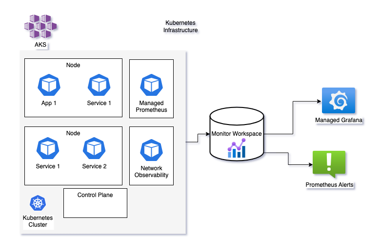
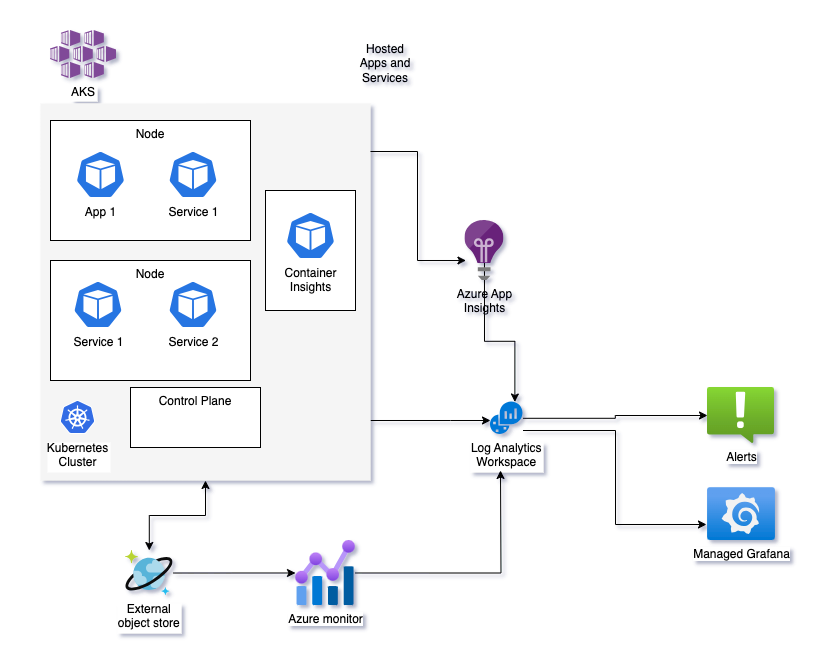

# Clear.Bank Theoretical Task - Design an observability platform

For this task I've made the the following decisions / assumptions
* The platform is hosted in Azure using AKS and Monitor
* Environments are separate.
* All resources exist in the same region and tenant.
* Open telemetry / structured logging / distributed tracing (where possible).

I've broken the platform down into two main areas, the first being the observability of the Kubernetes cluster itself and the second being the Apps / Services and external object storage. Please note that both the views below are of the same cluster.

## Kubernetes Infrastructure
For observability of the kubernetes infrastructure I've decided to go with the Azure Monitor managed service for Prometheus as the primary metric collector. This simplifies our operational overhead as it's a fully managed service - no need to operate the underlying infrastructure. 

Additionally the network observability add-on makes available a number of useful metrics in the Prometheus format, allowing simple addition of alerts and visualisations.

Kubernetes emits a lot of telemetry so we need to be careful about the volume of data we are capturing. To control our costs we need to choose what to capture based on our requirements, knowledge and judgement.

### Visualisation
As the metrics collected are in a standardised form, downstream visualisation is straightforward using managed Grafana with prebuilt and custom dashboards for Kube clusters. 

### Alerting
Alerting is straightforward through Prometheus rule groups, tying in to the standard alerting mechanisms that Azure offers. Additionally there are predefined alert rules which can be used as reference and enabled if required.

### Data retention
Currently data retention for Azure Monitor workspace is fixed at 18 months.

## Apps and Services
For observability of the apps and services running in the cluster I've gone with a two pronged approach, using both Container Insights and Application Insights. I believe Microsoft's long term road map combines both products. As Container Insights and Managed Prometheus have some cross-over, we can disable metrics already captured by Prometheus to help control costs.

For the apps and services it is preferable that any logs they emit are structured. This much improves the experience when examining logs and traces as we can query in a more precise fashion. 

Some effort is required to instrument applications to enable Application Insights. For .NET core web apps and services this is reasonably straightforward, adding the relevant OpenTelemetry nuget package, wiring the package into the application startup and configuring the connection string. App Insights supports sampling, enabling us to reduce the amount of data ingested and keep costs down.

For our external object store I've assumed use of CosmosDB, but similar approaches work with other persistent stores. Azure monitor diagnostic settings collect resource logs and write them to our log analytics workspace.

### Visualisation
We can point our managed grafana instance at the log analytics workspace to query both log based data collected from container insights and application insights log based metrics. We can also query our Cosmos requests, depending on our diagnostic settings.
Additionally if applications and services are integrated with App Insights, we can use all of the rich features such as the dashboard, map, tracing and availability.

### Alerting
Alerting is straightforward through alert rule groups, tying in to the standard alerting mechanisms that Azure offers. 

### Data retention 

Data retention can be controlled across the workspace and at individual table level. However you need a separate workspace if you require different retention settings for different resources that send data to the same tables.

## GitOps
All of the above resources can be deployed via terraform via the AzureRM and AzAPI providers. 
I'd use a fairly standard pipeline

### On Pull Request
* lint
* run static analysis
* run tests
* `terraform plan`, storing `out` file
* add comment to PR showing output of plan

### On Merge to main
* optional - manual gate to show changes in `out` file and get approval
* apply `out` file
